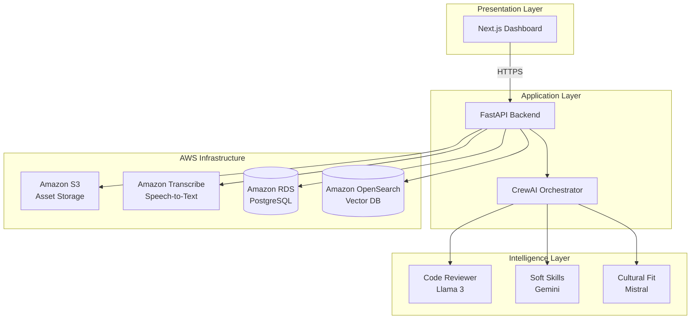
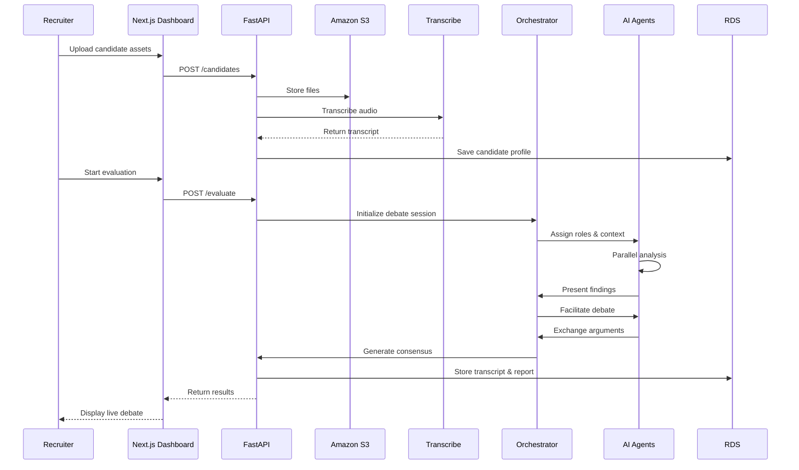

# Design Document: HireNexus

## Overview

HireNexus is a multi-agent hiring evaluation platform that simulates a virtual interview panel. The system orchestrates multiple AI models (Llama, Gemini, Mistral) to debate candidate qualifications based on resumes, code repositories, and voice recordings. The architecture follows a layered approach with clear separation between presentation (Next.js), application logic (FastAPI), cloud infrastructure (AWS), and the intelligence layer (multi-agent orchestration).

The core innovation is the debate protocol: rather than a single AI making opaque decisions, multiple specialized agents present evidence, challenge each other's findings, and synthesize a transparent consensus report that recruiters can audit and override.

## Architecture

### High-Level Architecture



### Component Interaction Flow



## Components and Interfaces

### 1. Presentation Layer (Next.js Dashboard)

**Technology Stack:**
- Next.js 14 (App Router)
- React 18
- Tailwind CSS
- Lucide-React for icons
- WebSocket client for real-time updates

**Key Components:**

**CandidateUploadForm:**
- Handles file uploads (resume PDF, audio, GitHub URL)
- Validates file types and sizes
- Displays upload progress
- Interface: `POST /api/candidates` with multipart/form-data

**LiveDebateViewer:**
- Displays real-time AI agent statements via WebSocket
- Color-codes agents (Code Reviewer: blue, Soft Skills: green, Cultural Fit: purple)
- Shows debate timeline with expandable statements
- Interface: WebSocket connection to `/ws/debate/{session_id}`

**ConsensusReportCard:**
- Renders final evaluation with strengths/weaknesses sections
- Displays confidence score as progress bar
- Provides Accept/Reject/Re-evaluate buttons
- Interface: `GET /api/reports/{report_id}`

**EvaluationHistoryTable:**
- Lists past evaluations with filters
- Supports search by candidate name or date range
- Interface: `GET /api/evaluations?page={n}&limit={m}`

### 2. Application Layer (FastAPI Backend)

**Technology Stack:**
- FastAPI 0.104+
- Python 3.11+
- Pydantic v2 for data validation
- SQLAlchemy 2.0 for ORM
- Asyncio for concurrency
- CrewAI for agent orchestration
- LiteLLM for unified model interface

**API Endpoints:**

```python
# Candidate Management
POST   /api/candidates              # Create candidate profile
GET    /api/candidates/{id}         # Retrieve candidate details
PUT    /api/candidates/{id}         # Update candidate info
DELETE /api/candidates/{id}         # Remove candidate

# Job Descriptions
POST   /api/job-descriptions        # Create JD with embeddings
GET    /api/job-descriptions/{id}   # Retrieve JD
PUT    /api/job-descriptions/{id}   # Update JD and re-embed
DELETE /api/job-descriptions/{id}   # Remove JD

# Evaluation
POST   /api/evaluate                # Start debate session
GET    /api/evaluate/{session_id}   # Get session status
WS     /ws/debate/{session_id}      # Real-time debate stream

# Reports
GET    /api/reports/{report_id}     # Get consensus report
POST   /api/reports/{report_id}/decision  # Record final decision
GET    /api/evaluations             # List evaluation history
```

**Core Services:**

**CandidateService:**
- Manages candidate CRUD operations
- Coordinates asset uploads to S3
- Triggers transcription jobs
- Interface: Async methods returning Pydantic models

**TranscriptionService:**
- Submits audio to Amazon Transcribe
- Polls for completion status
- Retrieves and stores transcripts
- Interface: `async def transcribe_audio(s3_uri: str) -> Transcript`

**JobDescriptionService:**
- Stores JD in RDS
- Generates embeddings using sentence-transformers
- Indexes embeddings in OpenSearch
- Interface: `async def create_jd(jd: JobDescriptionCreate) -> JobDescription`

**DebateOrchestrator:**
- Initializes CrewAI crew with agent roles
- Retrieves JD context from OpenSearch (RAG)
- Executes parallel agent analysis
- Facilitates multi-round debate
- Synthesizes consensus report
- Interface: `async def run_debate(candidate_id: str, jd_id: str) -> ConsensusReport`

### 3. AWS Infrastructure

**Amazon S3 Buckets:**
- `candidate-assets-{env}`: Stores resumes, audio files
- Lifecycle policy: Archive to Glacier after 1 year
- Encryption: SSE-S3 (AES-256)
- Access: IAM role-based, pre-signed URLs for uploads

**Amazon Transcribe:**
- Job configuration: Language auto-detection, speaker diarization
- Output format: JSON with timestamps
- Integration: Boto3 async client

**Amazon RDS (PostgreSQL 15):**

**Schema:**
```sql
-- Candidates table
CREATE TABLE candidates (
    id UUID PRIMARY KEY,
    name VARCHAR(255) NOT NULL,
    email VARCHAR(255) UNIQUE,
    created_at TIMESTAMP DEFAULT NOW()
);

-- Assets table
CREATE TABLE candidate_assets (
    id UUID PRIMARY KEY,
    candidate_id UUID REFERENCES candidates(id),
    asset_type VARCHAR(50), -- 'resume', 'audio', 'github'
    s3_uri TEXT NOT NULL,
    transcript_text TEXT,
    created_at TIMESTAMP DEFAULT NOW()
);

-- Job descriptions table
CREATE TABLE job_descriptions (
    id UUID PRIMARY KEY,
    title VARCHAR(255) NOT NULL,
    technical_skills TEXT[],
    soft_skills TEXT[],
    experience_level VARCHAR(50),
    full_description TEXT,
    created_at TIMESTAMP DEFAULT NOW()
);

-- Debate sessions table
CREATE TABLE debate_sessions (
    id UUID PRIMARY KEY,
    candidate_id UUID REFERENCES candidates(id),
    jd_id UUID REFERENCES job_descriptions(id),
    status VARCHAR(50), -- 'running', 'completed', 'failed'
    started_at TIMESTAMP DEFAULT NOW(),
    completed_at TIMESTAMP
);

-- Transcripts table
CREATE TABLE debate_transcripts (
    id UUID PRIMARY KEY,
    session_id UUID REFERENCES debate_sessions(id),
    agent_role VARCHAR(100),
    statement_text TEXT NOT NULL,
    timestamp TIMESTAMP DEFAULT NOW(),
    round_number INTEGER
);

-- Consensus reports table
CREATE TABLE consensus_reports (
    id UUID PRIMARY KEY,
    session_id UUID REFERENCES debate_sessions(id),
    strengths TEXT[],
    weaknesses TEXT[],
    recommendation VARCHAR(50), -- 'hire', 'reject', 'uncertain'
    confidence_score INTEGER, -- 0-100
    full_report TEXT,
    created_at TIMESTAMP DEFAULT NOW()
);

-- Final decisions table
CREATE TABLE final_decisions (
    id UUID PRIMARY KEY,
    report_id UUID REFERENCES consensus_reports(id),
    recruiter_id UUID,
    decision VARCHAR(50), -- 'accept', 'reject'
    justification TEXT,
    created_at TIMESTAMP DEFAULT NOW()
);
```

**Amazon OpenSearch (Serverless):**
- Index: `job-descriptions`
- Vector field: `description_embedding` (768 dimensions for sentence-transformers)
- Query: k-NN search for RAG context retrieval
- Access: IAM-based authentication

### 4. Intelligence Layer (Multi-Agent System)

**Agent Architecture:**

Each AI agent is a CrewAI Agent instance with:
- **Role**: Specialized evaluation focus
- **Goal**: Specific assessment objective
- **Backstory**: Persona description for consistent behavior
- **Tools**: Access to candidate assets and JD context
- **LLM**: Specific model (Llama 3, Gemini, Mistral)

**Agent Definitions:**

**Code Reviewer Agent:**
```python
code_reviewer = Agent(
    role="Senior Code Reviewer",
    goal="Evaluate technical skills through code quality analysis",
    backstory="Expert software engineer with 15 years experience...",
    tools=[github_analyzer, code_quality_checker],
    llm=ChatOllama(model="llama3"),
    verbose=True
)
```

**Soft Skills Evaluator Agent:**
```python
soft_skills_evaluator = Agent(
    role="Communication Specialist",
    goal="Assess interpersonal skills from interview transcripts",
    backstory="HR professional specializing in behavioral analysis...",
    tools=[transcript_analyzer, sentiment_analyzer],
    llm=ChatGoogleGenerativeAI(model="gemini-pro"),
    verbose=True
)
```

**Cultural Fit Assessor Agent:**
```python
cultural_fit_assessor = Agent(
    role="Cultural Alignment Expert",
    goal="Determine candidate alignment with company values",
    backstory="Organizational psychologist with expertise in...",
    tools=[value_matcher, experience_analyzer],
    llm=ChatMistral(model="mistral-medium"),
    verbose=True
)
```

**Debate Protocol:**

The debate follows a structured multi-phase process:

**Phase 1: Independent Analysis (Parallel)**
- Each agent receives candidate assets and JD context
- Agents perform initial evaluation independently
- Duration: 30-60 seconds per agent
- Output: Initial findings document

**Phase 2: Presentation Round**
- Agents present findings sequentially
- Each agent gets 2 minutes to present
- Findings include evidence citations
- Output: Presentation statements

**Phase 3: Cross-Examination (3 rounds)**
- Agents challenge each other's findings
- Must cite specific evidence
- Can request clarification
- Round limit: 5 exchanges per agent
- Output: Debate transcript

**Phase 4: Consensus Synthesis**
- Supervisor agent (Claude via Bedrock) reviews all statements
- Identifies areas of agreement and disagreement
- Synthesizes balanced report
- Calculates confidence score based on agent alignment
- Output: Consensus report

**CrewAI Task Definitions:**

```python
# Task 1: Initial Analysis
analysis_task = Task(
    description="Analyze candidate {candidate_name} for {jd_title} role",
    agent=code_reviewer,
    expected_output="Structured evaluation with scores and evidence"
)

# Task 2: Debate Facilitation
debate_task = Task(
    description="Discuss candidate qualifications with other agents",
    agent=code_reviewer,
    expected_output="Debate statements with supporting evidence",
    context=[analysis_task]
)

# Task 3: Consensus Generation
consensus_task = Task(
    description="Synthesize all agent perspectives into final report",
    agent=supervisor_agent,
    expected_output="Consensus report with strengths, weaknesses, recommendation",
    context=[debate_task]
)
```

## Data Models

### Pydantic Models

```python
from pydantic import BaseModel, Field, HttpUrl
from typing import List, Optional, Literal
from datetime import datetime
from uuid import UUID

class CandidateCreate(BaseModel):
    name: str = Field(..., min_length=1, max_length=255)
    email: str = Field(..., pattern=r'^[\w\.-]+@[\w\.-]+\.\w+$')

class CandidateAsset(BaseModel):
    id: UUID
    candidate_id: UUID
    asset_type: Literal['resume', 'audio', 'github']
    s3_uri: str
    transcript_text: Optional[str] = None
    created_at: datetime

class Candidate(BaseModel):
    id: UUID
    name: str
    email: str
    assets: List[CandidateAsset] = []
    created_at: datetime

class JobDescriptionCreate(BaseModel):
    title: str = Field(..., min_length=1, max_length=255)
    technical_skills: List[str]
    soft_skills: List[str]
    experience_level: Literal['junior', 'mid', 'senior', 'lead']
    full_description: str

class JobDescription(BaseModel):
    id: UUID
    title: str
    technical_skills: List[str]
    soft_skills: List[str]
    experience_level: str
    full_description: str
    created_at: datetime

class DebateStatement(BaseModel):
    agent_role: str
    statement_text: str
    timestamp: datetime
    round_number: int
    evidence_citations: List[str] = []

class ConsensusReport(BaseModel):
    id: UUID
    session_id: UUID
    strengths: List[str]
    weaknesses: List[str]
    recommendation: Literal['hire', 'reject', 'uncertain']
    confidence_score: int = Field(..., ge=0, le=100)
    full_report: str
    created_at: datetime

class FinalDecision(BaseModel):
    id: UUID
    report_id: UUID
    recruiter_id: UUID
    decision: Literal['accept', 'reject']
    justification: Optional[str] = None
    created_at: datetime
```

## Correctness Properties

*A property is a characteristic or behavior that should hold true across all valid executions of a system—essentially, a formal statement about what the system should do. Properties serve as the bridge between human-readable specifications and machine-verifiable correctness guarantees.*


### Property 1: Asset Upload and Storage Consistency

*For any* valid candidate asset (resume PDF, audio file, or GitHub URL), when uploaded by a recruiter, the system should store the asset in S3 and create a corresponding database record with the correct asset type and candidate association.

**Validates: Requirements 1.1, 1.2, 1.3, 1.4**

### Property 2: GitHub URL Validation

*For any* string provided as a GitHub URL, the system should accept it if and only if it matches the pattern `https://github.com/{owner}/{repo}`, rejecting all other formats.

**Validates: Requirements 1.3**

### Property 3: Transcription Round-Trip

*For any* audio file uploaded to the system, if transcription succeeds, then querying the candidate's assets should return a transcript text associated with that audio file.

**Validates: Requirements 2.1, 2.2, 2.4**

### Property 4: Transcription Error Handling

*For any* transcription job that fails, the system should create an error log entry and send a notification to the recruiter who uploaded the audio.

**Validates: Requirements 2.3**

### Property 5: Job Description Embedding Consistency

*For any* job description, after creation or update, querying the vector database with the JD's ID should return embeddings that semantically match the JD's full description text.

**Validates: Requirements 3.2, 3.3**

### Property 6: Job Description Deletion Cascade

*For any* job description that is deleted, querying the vector database for its embeddings should return no results.

**Validates: Requirements 3.5**

### Property 7: Required Field Validation

*For any* job description creation request, the system should reject it if and only if it is missing one or more required fields (title, technical_skills, soft_skills, experience_level).

**Validates: Requirements 3.4**

### Property 8: Multi-Agent Initialization

*For any* debate session that starts, the system should instantiate exactly three or more AI agents, each with a distinct role, and each agent should receive the relevant job description context.

**Validates: Requirements 4.1, 4.2, 4.3**

### Property 9: Parallel Execution Performance

*For any* debate session with N agents performing initial analysis, the total execution time should be closer to the time of the slowest agent than to the sum of all agent times (demonstrating parallelism).

**Validates: Requirements 4.4**

### Property 10: Debate Phase Sequencing

*For any* debate session, the debate phase should begin if and only if all agents have completed their initial analysis phase.

**Validates: Requirements 4.5**

### Property 11: Agent Presentation Completeness

*For any* debate session, each instantiated agent should have at least one statement recorded in the transcript during the presentation phase.

**Validates: Requirements 5.1**

### Property 12: Debate Round Limit

*For any* debate session, no agent should have more than five statements recorded in the cross-examination phase.

**Validates: Requirements 5.3**

### Property 13: Evidence Citation Requirement

*For any* agent statement in the debate transcript, the statement should include at least one citation referencing a candidate asset or job description element.

**Validates: Requirements 5.4**

### Property 14: Transcript Completeness

*For any* debate session that completes, the stored transcript should contain all agent statements with timestamps, agent identifiers, and round numbers.

**Validates: Requirements 5.5, 7.1**

### Property 15: Consensus Report Generation

*For any* completed debate session, the system should generate exactly one consensus report containing non-empty strengths, weaknesses, and recommendation fields.

**Validates: Requirements 6.1, 6.2**

### Property 16: Evidence Traceability

*For any* consensus report, each strength and weakness listed should reference at least one statement from the debate transcript.

**Validates: Requirements 6.3**

### Property 17: Confidence Score Bounds

*For any* consensus report, the confidence score should be an integer between 0 and 100 inclusive.

**Validates: Requirements 6.4**

### Property 18: Unanimous Agreement Confidence

*For any* debate session where all agents recommend the same decision (all hire or all reject), the consensus report confidence score should be at least 80.

**Validates: Requirements 6.5**

### Property 19: Report Referential Integrity

*For any* consensus report, it should maintain valid foreign key references to both a candidate and a job description through its associated debate session.

**Validates: Requirements 7.2, 7.3**

### Property 20: Real-Time Statement Broadcasting

*For any* agent statement created during an active debate session, a WebSocket message should be sent to all connected clients within 1 second.

**Validates: Requirements 8.1**

### Property 21: Report Structure Rendering

*For any* consensus report displayed on the dashboard, the rendered HTML should contain distinct sections identifiable by CSS classes or IDs for strengths, weaknesses, and recommendation.

**Validates: Requirements 8.3**

### Property 22: Timeline Data Structure

*For any* debate session, the timeline data should be ordered chronologically by timestamp and include all agent statements with their round numbers.

**Validates: Requirements 8.4**

### Property 23: Evidence Linking

*For any* agent statement that cites a candidate asset, selecting that statement in the UI should trigger retrieval of the referenced asset data.

**Validates: Requirements 8.5**

### Property 24: GitHub Metadata Retrieval

*For any* valid and accessible GitHub repository URL, the system should fetch and store metadata including at least language distribution and commit count.

**Validates: Requirements 9.1**

### Property 25: Repository Access Error Handling

*For any* GitHub repository URL that returns a 404 or 403 error, the system should create a notification for the recruiter and mark the code analysis as skipped.

**Validates: Requirements 9.4**

### Property 26: Code Analysis Output Structure

*For any* completed code analysis, the agent findings should include at least one specific file path from the repository.

**Validates: Requirements 9.5**

### Property 27: Final Decision Persistence

*For any* final decision made by a recruiter, the system should create a database record containing the decision, recruiter ID, timestamp, and report reference.

**Validates: Requirements 10.2**

### Property 28: Contradictory Decision Validation

*For any* final decision that contradicts the AI recommendation (e.g., reject when AI recommends hire), the system should require a non-empty justification field.

**Validates: Requirements 10.3**

### Property 29: Comment Association

*For any* comment added to a consensus report, querying that report should return the comment with its author and timestamp.

**Validates: Requirements 10.4**

### Property 30: Status Update on Decision

*For any* final decision recorded, the associated candidate's status field should be updated to reflect the decision within the same database transaction.

**Validates: Requirements 10.5**

### Property 31: Session Isolation

*For any* two debate sessions running concurrently, agent statements from one session should never appear in the transcript of the other session.

**Validates: Requirements 11.2**

### Property 32: Rate Limiting Enforcement

*For any* recruiter making more than 100 API requests within a 60-second window, the 101st request should receive a 429 (Too Many Requests) HTTP status code.

**Validates: Requirements 11.3**

### Property 33: Structured Error Responses

*For any* API request that results in an error, the response should be valid JSON containing at least an error code, message, and appropriate HTTP status code (4xx or 5xx).

**Validates: Requirements 11.4**

### Property 34: Request Logging Completeness

*For any* API request processed by the system, a log entry should be created containing the timestamp, endpoint path, HTTP method, and response time.

**Validates: Requirements 11.5**

### Property 35: Authentication Token Issuance

*For any* valid recruiter credentials submitted to the authentication endpoint, the system should return a JWT token with an expiration time set to 24 hours from issuance.

**Validates: Requirements 12.3**

### Property 36: Authorization Enforcement

*For any* API request to access candidate data, if the requester's token does not have permission for that candidate, the system should return a 403 (Forbidden) status code.

**Validates: Requirements 12.4**

## Error Handling

### Error Categories

**1. Client Errors (4xx):**
- 400 Bad Request: Invalid input data (malformed JSON, missing required fields)
- 401 Unauthorized: Missing or invalid authentication token
- 403 Forbidden: Insufficient permissions for requested resource
- 404 Not Found: Requested candidate, JD, or report does not exist
- 413 Payload Too Large: File upload exceeds 50MB limit
- 429 Too Many Requests: Rate limit exceeded

**2. Server Errors (5xx):**
- 500 Internal Server Error: Unexpected application errors
- 502 Bad Gateway: AWS service (S3, Transcribe, OpenSearch) unavailable
- 503 Service Unavailable: System overloaded or in maintenance mode
- 504 Gateway Timeout: AI agent or AWS service timeout

### Error Response Format

All errors return consistent JSON structure:

```json
{
  "error": {
    "code": "VALIDATION_ERROR",
    "message": "Job description missing required field: technical_skills",
    "details": {
      "field": "technical_skills",
      "constraint": "required"
    },
    "timestamp": "2024-02-14T10:30:00Z",
    "request_id": "req_abc123"
  }
}
```

### Retry Logic

**Transient Failures:**
- S3 upload failures: Retry up to 3 times with exponential backoff
- Transcribe job polling: Retry every 10 seconds for up to 5 minutes
- OpenSearch queries: Retry up to 2 times with 1-second delay
- AI agent timeouts: Retry once, then fail the debate session

**Permanent Failures:**
- Invalid credentials: No retry, return 401 immediately
- File size exceeded: No retry, return 413 immediately
- Rate limit exceeded: No retry, return 429 with Retry-After header

### Graceful Degradation

**Partial Asset Availability:**
- If GitHub analysis fails, proceed with resume and audio analysis only
- If audio transcription fails, proceed with resume and code analysis only
- If only one asset type available, run debate with limited context

**Agent Failures:**
- If one agent fails during analysis, continue with remaining agents
- If two or more agents fail, abort debate session and notify recruiter
- If consensus generation fails, return individual agent reports

### Logging Strategy

**Log Levels:**
- ERROR: System failures, unhandled exceptions, AWS service errors
- WARN: Retryable failures, degraded functionality, rate limit approaches
- INFO: Successful operations, debate milestones, decision recordings
- DEBUG: Detailed agent statements, API request/response bodies

**Structured Logging:**
```python
logger.info(
    "Debate session completed",
    extra={
        "session_id": session.id,
        "candidate_id": candidate.id,
        "duration_seconds": duration,
        "agent_count": len(agents),
        "recommendation": report.recommendation
    }
)
```

## Testing Strategy

### Dual Testing Approach

The system will employ both unit testing and property-based testing to ensure comprehensive coverage:

**Unit Tests:**
- Verify specific examples and edge cases
- Test integration points between components
- Validate error conditions and boundary values
- Focus on concrete scenarios with known inputs/outputs

**Property-Based Tests:**
- Verify universal properties across all inputs
- Use randomized input generation to discover edge cases
- Ensure correctness properties hold for large input spaces
- Complement unit tests by testing general behavior

Both testing approaches are necessary and complementary. Unit tests catch specific bugs and validate concrete behavior, while property tests verify that general correctness properties hold across all possible inputs.

### Property-Based Testing Configuration

**Framework:** Hypothesis (Python)

**Configuration:**
- Minimum 100 iterations per property test
- Each test tagged with feature name and property number
- Tag format: `# Feature: consensus-ai-auditor, Property {N}: {property_text}`

**Example Property Test:**

```python
from hypothesis import given, strategies as st
import pytest

# Feature: hire-nexus, Property 17: Confidence Score Bounds
@given(
    strengths=st.lists(st.text(min_size=1), min_size=1),
    weaknesses=st.lists(st.text(min_size=1), min_size=1),
    agent_recommendations=st.lists(
        st.sampled_from(['hire', 'reject', 'uncertain']),
        min_size=3,
        max_size=3
    )
)
@pytest.mark.property_test
def test_confidence_score_bounds(strengths, weaknesses, agent_recommendations):
    """For any consensus report, confidence score should be 0-100."""
    report = generate_consensus_report(
        strengths=strengths,
        weaknesses=weaknesses,
        agent_recommendations=agent_recommendations
    )
    assert 0 <= report.confidence_score <= 100
```

### Unit Testing Strategy

**Test Organization:**
- Co-locate tests with source files using `test_*.py` naming
- Group tests by component (services, models, API endpoints)
- Use pytest fixtures for common test data

**Coverage Targets:**
- Minimum 80% code coverage for business logic
- 100% coverage for data validation and security functions
- Focus on critical paths: debate orchestration, consensus generation

**Key Test Scenarios:**

**API Endpoint Tests:**
```python
def test_create_candidate_with_resume():
    """Test candidate creation with resume upload."""
    response = client.post(
        "/api/candidates",
        data={"name": "John Doe", "email": "john@example.com"},
        files={"resume": ("resume.pdf", pdf_content, "application/pdf")}
    )
    assert response.status_code == 201
    assert response.json()["name"] == "John Doe"
    # Verify S3 upload occurred
    assert s3_client.head_object(Bucket=bucket, Key=f"resumes/{candidate_id}.pdf")
```

**Service Layer Tests:**
```python
def test_transcription_service_handles_failure():
    """Test transcription service error handling."""
    # Mock Transcribe failure
    mock_transcribe.start_transcription_job.side_effect = ClientError(...)
    
    with pytest.raises(TranscriptionError):
        await transcription_service.transcribe_audio("s3://bucket/audio.mp3")
    
    # Verify error was logged
    assert "Transcription failed" in caplog.text
```

**Debate Orchestration Tests:**
```python
def test_debate_orchestrator_agent_isolation():
    """Test that concurrent debates don't interfere."""
    session1 = await orchestrator.run_debate(candidate1_id, jd1_id)
    session2 = await orchestrator.run_debate(candidate2_id, jd2_id)
    
    # Verify transcripts are separate
    transcript1 = await get_transcript(session1.id)
    transcript2 = await get_transcript(session2.id)
    
    assert set(transcript1.statements) & set(transcript2.statements) == set()
```

### Integration Testing

**AWS Service Integration:**
- Use LocalStack for local AWS service emulation
- Test S3 upload/download, Transcribe job lifecycle, OpenSearch queries
- Verify IAM permissions and encryption settings

**Database Integration:**
- Use pytest-postgresql for isolated test databases
- Test complex queries, foreign key constraints, cascading deletes
- Verify transaction isolation and rollback behavior

**End-to-End Flows:**
- Test complete candidate evaluation workflow
- Verify WebSocket real-time updates
- Test authentication and authorization flows

### Performance Testing

**Load Testing:**
- Simulate 50 concurrent API requests using Locust
- Verify response times under load (p95 < 500ms for API endpoints)
- Test debate session concurrency (10 simultaneous debates)

**Stress Testing:**
- Test system behavior at 2x expected load
- Verify graceful degradation when resources exhausted
- Test recovery after service failures

### Security Testing

**Authentication/Authorization:**
- Test JWT token validation and expiration
- Verify permission checks for all protected endpoints
- Test rate limiting enforcement

**Input Validation:**
- Fuzz test API endpoints with malformed inputs
- Test SQL injection prevention
- Verify file upload restrictions (size, type)

**Data Protection:**
- Verify S3 encryption at rest
- Test TLS enforcement for all connections
- Verify sensitive data is not logged

## Deployment Architecture

### AWS Infrastructure

**Compute:**
- AWS App Runner for FastAPI backend (auto-scaling, 1-10 instances)
- Container: Python 3.11 with FastAPI, CrewAI, LiteLLM
- Health check: `/health` endpoint

**Storage:**
- S3 bucket with versioning enabled
- Lifecycle policy: Transition to Glacier after 365 days
- CORS configuration for direct browser uploads

**Database:**
- RDS PostgreSQL 15 (db.t3.medium for production)
- Multi-AZ deployment for high availability
- Automated backups with 7-day retention

**Vector Database:**
- OpenSearch Serverless collection
- 768-dimensional vectors (sentence-transformers)
- k-NN index with HNSW algorithm

**Transcription:**
- Amazon Transcribe with automatic language detection
- Speaker diarization enabled
- Custom vocabulary for technical terms

### Frontend Deployment

**Hosting:**
- Vercel for Next.js application
- Edge functions for API routes
- CDN for static assets

**Environment Variables:**
```
NEXT_PUBLIC_API_URL=https://api.hirenexus.com
NEXT_PUBLIC_WS_URL=wss://api.hirenexus.com/ws
```

### CI/CD Pipeline

**GitHub Actions Workflow:**

```yaml
name: Deploy

on:
  push:
    branches: [main]

jobs:
  test:
    runs-on: ubuntu-latest
    steps:
      - uses: actions/checkout@v3
      - name: Run unit tests
        run: pytest tests/unit
      - name: Run property tests
        run: pytest tests/property -m property_test
      - name: Check coverage
        run: pytest --cov=app --cov-report=xml
  
  deploy-backend:
    needs: test
    runs-on: ubuntu-latest
    steps:
      - name: Build container
        run: docker build -t hirenexus-api .
      - name: Push to ECR
        run: aws ecr push ...
      - name: Deploy to App Runner
        run: aws apprunner update-service ...
  
  deploy-frontend:
    needs: test
    runs-on: ubuntu-latest
    steps:
      - name: Deploy to Vercel
        run: vercel deploy --prod
```

### Monitoring and Observability

**Metrics:**
- CloudWatch metrics for API latency, error rates, request counts
- Custom metrics for debate session duration, agent response times
- Database connection pool utilization

**Logging:**
- CloudWatch Logs for application logs
- Structured JSON logging with correlation IDs
- Log retention: 30 days

**Alerting:**
- PagerDuty integration for critical errors
- Slack notifications for warnings
- Alert on: API error rate > 5%, debate session failures, database connection errors

**Tracing:**
- AWS X-Ray for distributed tracing
- Trace debate sessions from upload to consensus generation
- Identify performance bottlenecks in agent orchestration

## Future Enhancements

**Multi-Language Support:**
- Internationalize UI for global recruiters
- Support non-English resumes and interviews

**Advanced Analytics:**
- Aggregate hiring metrics across candidates
- Identify bias patterns in AI recommendations
- Track recruiter override rates

**Custom Agent Roles:**
- Allow recruiters to define custom evaluation criteria
- Train specialized agents for specific industries

**Video Interview Analysis:**
- Extend to video interviews with facial expression analysis
- Analyze body language and presentation skills

**Candidate Feedback Loop:**
- Provide candidates with anonymized feedback
- Allow candidates to dispute AI findings
